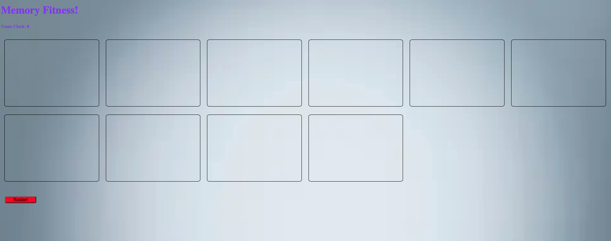

# memory_fitness

Memory Fitness is a simple JS Web Application, users have 30 seconds to match blocks after 30 seconds the game will end.

### How to Play
* select whether you would like to play
* Game clock starts, user has 15 seconds to complete the game by matching block colors
* User as the ability to end the game and restart

### Technologies used:
* HTML
* CSS
* JavaScript
* DOM Manipulation
