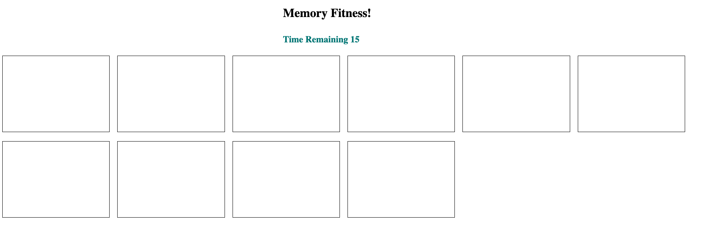

# memory_fitness

Memory Fitness is a simple JS Web Application, users have 30 seconds to match the same colors after 30 seconds the game will end and the results will be displayed in an alert.

### How to Play
* Click start button to start the game
* Game clock starts, user has 30 seconds to complete the game by matching colors
* User will get an alert when there a match has been located
* User as the ability to end the game and restart
* Once the game is over no more, the user will not be able to click on any blocks

### Technologies used:
* HTML
* CSS
* JavaScript
* DOM Manipulation
